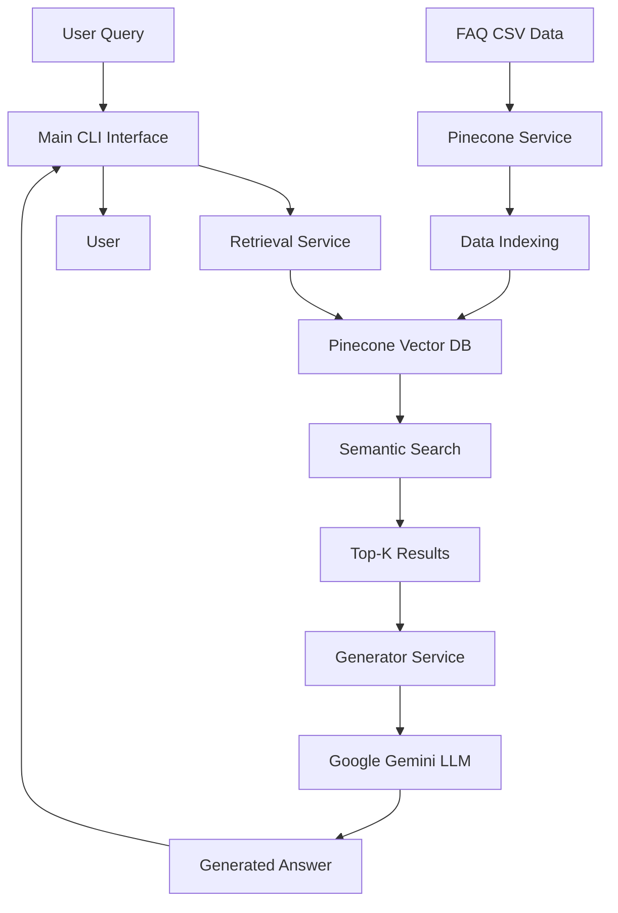

# RAG-Based QA System - Project Details

## 📋 Project Overview

**Project Name:** RAG-Based QA System  
**Repository:** jayy0335/Rag-Based-QA-System  
**Type:** Retrieval-Augmented Generation (RAG) System  
**Purpose:** Intelligent FAQ question-answering system using semantic search and large language models  
**Status:** Active Development  
**Created:** Part of Self Learning Journey

---

## 🎯 Project Objectives

The RAG-Based QA System is designed to:

1. **Provide Accurate Answers**: Deliver precise responses to user questions based on indexed FAQ data
2. **Semantic Understanding**: Use vector embeddings to understand questions beyond exact keyword matching
3. **Context-Aware Responses**: Generate human-like answers grounded in retrieved context
4. **Scalable Architecture**: Support easy extension and modification of components
5. **User-Friendly Interface**: Offer an intuitive CLI for interactive querying

---

## 🏗️ System Architecture

### High-Level Architecture



### Component Breakdown

#### 1. **Data Layer**
- **Source**: `cleaned_faq.csv` containing FAQ questions and answers
- **Storage**: Pinecone vector database with embedded representations
- **Namespace**: `faq` for organized data management

#### 2. **Service Layer**
- **Pinecone Service**: Handles index initialization and data ingestion
- **Retrieval Service**: Performs semantic search operations
- **Generator Service**: Orchestrates LLM-based response generation

#### 3. **Helper Layer**
- **Configuration**: Centralized settings and environment management
- **Logger**: Structured logging for debugging and monitoring
- **Prompt**: System instructions for LLM behavior

#### 4. **Interface Layer**
- **CLI**: Command-line interface for user interaction

---

## 🛠️ Technology Stack

### Core Technologies

| Component | Technology | Version | Purpose |
|-----------|-----------|---------|---------|
| **Language** | Python | 3.10+ | Primary development language |
| **Vector DB** | Pinecone | 3.0.0+ | Semantic search and embedding storage |
| **LLM** | Google Gemini | Latest | Response generation |
| **Embeddings** | OpenAI text-embedding-3-large | - | Vector representations |
| **Data Processing** | Pandas | 1.5.0+ | CSV data handling |
| **Environment** | python-dotenv | 1.0.0+ | Configuration management |

### Infrastructure

- **Cloud Provider**: AWS (Pinecone hosting)
- **Region**: us-east-1
- **Index Type**: Serverless Pinecone index

---

## ✨ Key Features

### 1. **Semantic Search**
- Uses state-of-the-art embeddings (`text-embedding-3-large`)
- Finds relevant answers even with paraphrased questions
- Returns top-10 most relevant FAQ entries

### 2. **Context-Aware Generation**
- Employs Google Gemini Flash for fast, accurate responses
- Temperature set to 0.1 for factual, consistent answers
- Strictly grounds responses in retrieved context

### 3. **Dynamic Indexing**
- Automatically checks for existing Pinecone index on startup
- Creates index if not present
- Loads and indexes CSV data seamlessly

### 4. **Extensible Architecture**
- Modular service design
- Easy to swap components (e.g., different LLMs or vector DBs)
- Clear separation of concerns

### 5. **Interactive CLI**
- User-friendly command-line interface
- Continuous query loop
- Graceful error handling

### 6. **Robust Error Handling**
- Comprehensive logging throughout the system
- Fallback responses for edge cases
- Validation of data sources and API connections

---

## 📁 Project Structure

```
Rag-Based-QA-System/
├── main.py                      # Entry point: CLI interface
├── requirements.txt             # Python dependencies
├── .env                         # API keys (not in version control)
├── .gitignore                   # Git ignore rules
├── README.md                    # Project documentation
├── image.png                    # Project visualization
│
├── Libraries/
│   └── lib.py                   # Centralized imports
│
├── services/
│   ├── __init__.py
│   ├── pinecone_service.py      # Index management & data loading
│   ├── retrieval.py             # Semantic search logic
│   └── generator.py             # LLM response generation
│
└── src/
    ├── helpers/
    │   ├── config.py            # Configuration settings
    │   ├── logger.py            # Logging utilities
    │   └── prompt.py            # System prompts for LLM
    │
    └── data/
        └── cleaned_faq.csv      # Source FAQ dataset
```

---

## 🔧 Configuration Details

### Environment Variables

```env
PINECONE_API_KEY=<your_pinecone_api_key>
GEMINI_API_KEYS=<your_gemini_api_key>
```

### Pinecone Configuration

- **Index Name**: `developer-quickstart-py`
- **Cloud**: AWS
- **Region**: us-east-1
- **Embedding Model**: text-embedding-3-large
- **Namespace**: faq

### Gemini Configuration

- **Model**: gemini-flash-latest
- **Temperature**: 0.1 (factual responses)
- **Top-P**: 0.95
- **Top-K**: 50

---

## 🚀 Setup & Installation

### Prerequisites

1. **Python 3.10 or higher**
2. **Pinecone API Key** - [Get from Pinecone](https://www.pinecone.io/)
3. **Google AI (Gemini) API Key** - [Get from Google AI Studio](https://ai.google.dev/)

### Installation Steps

1. **Clone the repository**
   ```bash
   git clone https://github.com/jayy0335/Rag-Based-QA-System.git
   cd Rag-Based-QA-System
   ```

2. **Install dependencies**
   ```bash
   pip install -r requirements.txt
   ```

3. **Configure environment**
   - Create a `.env` file in the project root
   - Add your API keys:
     ```env
     PINECONE_API_KEY="your_pinecone_key"
     GEMINI_API_KEYS="your_gemini_key"
     ```

4. **Prepare data**
   - Ensure `src/data/cleaned_faq.csv` exists
   - CSV should have columns: `questions`, `answers`

5. **Run the application**
   ```bash
   python main.py
   ```

---

## 💡 How It Works

### Data Indexing Flow

1. **Initialization**: System checks for Pinecone index
2. **Index Creation**: If not present, creates index with embedding model
3. **Data Loading**: Reads FAQ CSV file
4. **Text Preparation**: Combines questions and answers into searchable chunks
5. **Embedding & Upload**: Generates embeddings and uploads to Pinecone in batches

### Query Processing Flow

1. **User Input**: User enters a question via CLI
2. **Semantic Search**: Query is embedded and searched against Pinecone index
3. **Context Retrieval**: Top-10 most relevant FAQ entries are retrieved
4. **Prompt Construction**: System prompt + context + user query combined
5. **LLM Generation**: Gemini generates answer based on context
6. **Response Display**: Answer is formatted and shown to user

---

## 🔍 Component Details

### 1. Pinecone Service ([pinecone_service.py](file:///c:/jazibfolder/jazib/jazib/self%20learning%20jazib/Rag-Based-QA-System/services/pinecone_service.py))

**Functions:**
- `initialize_pinecone_index()`: Connects to or creates Pinecone index
- `load_and_index_data()`: Loads CSV and indexes data

**Key Features:**
- Uses Pinecone's integrated embedding model
- Batch upsert (50 records per batch) for efficiency
- Automatic index creation with proper configuration

### 2. Retrieval Service ([retrieval.py](file:///c:/jazibfolder/jazib/jazib/self%20learning%20jazib/Rag-Based-QA-System/services/retrieval.py))

**Functions:**
- `retrieve_relevant_documents(query, top_k=10)`: Performs semantic search

**Key Features:**
- Returns top-10 matches by default
- Uses Pinecone's search_records API
- Error handling with fallback empty results

### 3. Generator Service ([generator.py](file:///c:/jazibfolder/jazib/jazib/self%20learning%20jazib/Rag-Based-QA-System/services/generator.py))

**Functions:**
- `generate_answer(query)`: Orchestrates retrieval and generation

**Key Features:**
- Combines retrieved context into structured prompt
- Configures Gemini for factual responses (low temperature)
- Handles cases with no relevant context

### 4. Configuration ([config.py](file:///c:/jazibfolder/jazib/jazib/self%20learning%20jazib/Rag-Based-QA-System/src/helpers/config.py))

**Responsibilities:**
- Loads environment variables
- Defines all system constants
- Manages file paths
- Ensures data directory exists

---

## 📊 Data Format

### Input CSV Structure

```csv
questions,answers
"What is Python?","Python is a high-level programming language..."
"How do I install packages?","Use pip install <package_name>..."
```

### Indexed Document Format

Each FAQ entry is stored as:

```python
{
    "_id": "faq_0",
    "chunk_text": "FAQ Question: ... | FAQ Answer: ... | Type: FAQ | Source: CSV",
    "question": "original question",
    "answer": "original answer"
}
```

---

## 🎨 Usage Examples

### Starting the System

```bash
$ python main.py

    ╔══════════════════════════════════════════╗
    ║           FAQ RAG System                 ║
    ║  Ask questions about the indexed FAQ     ║
    ║  Type 'exit' or 'quit' to end the session ║
    ╚══════════════════════════════════════════╝

Checking Pinecone index...
✅ Successfully indexed 100 FAQ entries in Pinecone.

RAG System is ready!
Enter your questions below. Type 'exit' or 'quit' to end the session.
--------------------------------------------------

Your question: 
```

### Sample Interaction

```
Your question: How do I reset my password?

Searching for answers...

==================================================
Question: How do I reset my password?
--------------------------------------------------
Answer: To reset your password, click on the "Forgot Password" 
link on the login page. You'll receive an email with instructions 
to create a new password. Make sure to check your spam folder if 
you don't see the email within a few minutes.
==================================================
```

---

## 🔐 Security Considerations

> [!IMPORTANT]
> **API Key Management**: Never commit `.env` file to version control. The `.gitignore` file should include `.env`.

> [!WARNING]
> **Exposed Keys**: The current `.env` file in the repository contains exposed API keys. These should be rotated immediately.

### Best Practices

1. **Environment Variables**: Always use `.env` for sensitive data
2. **Key Rotation**: Regularly rotate API keys
3. **Access Control**: Limit API key permissions to minimum required
4. **Monitoring**: Track API usage for unusual patterns

---

## 🧪 Testing & Validation

### Manual Testing Checklist

- [ ] System starts without errors
- [ ] Pinecone index is created/connected successfully
- [ ] CSV data is loaded and indexed
- [ ] Queries return relevant results
- [ ] Answers are factually grounded in context
- [ ] Error handling works for invalid inputs
- [ ] Exit commands work properly

### Future Testing Enhancements

- Unit tests for each service
- Integration tests for end-to-end flow
- Performance benchmarks for query latency
- Accuracy metrics for answer quality

---

## 📈 Performance Characteristics

### Current Metrics

- **Indexing Speed**: ~50 records per batch
- **Query Latency**: ~2-3 seconds (retrieval + generation)
- **Top-K Results**: 10 (configurable)
- **Embedding Model**: text-embedding-3-large (high quality)

### Optimization Opportunities

1. **Caching**: Cache frequent queries
2. **Batch Processing**: Process multiple queries in parallel
3. **Index Optimization**: Tune Pinecone index parameters
4. **Model Selection**: Experiment with different embedding models

---

## 🚧 Known Limitations

1. **CSV Dependency**: Currently only supports CSV input
2. **Single Namespace**: All FAQs in one namespace
3. **No User Authentication**: CLI is open to all users
4. **Limited Error Recovery**: Some errors require restart
5. **No Answer Validation**: No mechanism to verify answer accuracy

---

## 🔮 Future Enhancements

### Short-term

- [ ] Add support for multiple data sources (JSON, databases)
- [ ] Implement answer confidence scoring
- [ ] Add query history and analytics
- [ ] Create web interface (Flask/FastAPI)

### Long-term

- [ ] Multi-language support
- [ ] User feedback loop for answer quality
- [ ] Advanced filtering and faceted search
- [ ] Integration with external knowledge bases
- [ ] Real-time data updates without reindexing

---

## 📚 Dependencies

```txt
python-dotenv>=1.0.0    # Environment variable management
pandas>=1.5.0           # Data processing
pinecone-client>=3.0.0  # Vector database client
google-generativeai>=0.3.0  # Gemini LLM client
```

---

## 🤝 Contributing

This is a personal learning project. Contributions, suggestions, and feedback are welcome!

### Development Workflow

1. Fork the repository
2. Create a feature branch
3. Make your changes
4. Test thoroughly
5. Submit a pull request

---

## 📝 License

This project is part of a self-learning journey. Please check the repository for license information.

---

## 📞 Support & Contact

For questions or issues:
- **Repository**: [jayy0335/Rag-Based-QA-System](https://github.com/jayy0335/Rag-Based-QA-System)
- **Issues**: Use GitHub Issues for bug reports and feature requests

---

## 🙏 Acknowledgments

- **Pinecone**: For providing excellent vector database services
- **Google**: For the Gemini API and generative AI capabilities
- **OpenAI**: For the text-embedding-3-large model

---

*Last Updated: February 9, 2026*
